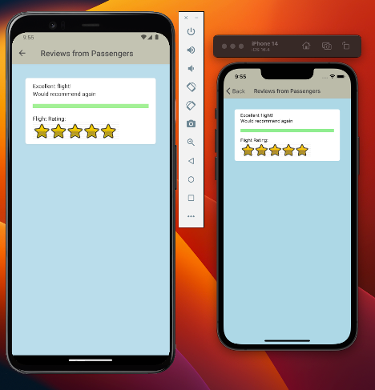

# React Native App - Airport Simulation

## Diagram

## Images

Below is an example of how a basic review screen looks like:

## Tools and Technologies

## Why I chose React-Native over alternatives?

- While tools like Flutter can be compatible with many Android devices, React Native apps sometimes require lower SDK version minimums, making them more lightweight.
- In my opinion, React Native supports third-party plugs and can have cost-effective feature expansion with many independent modules.
- While Kotlin works well with existing Java code compiling, React Native is open-source and community-driven, allowing developers like myself to reach out to a large community for resources and tutorials.

## Future Work

- One thing I can add is a component that will let me use a side drawer menu, beginning with a button.
