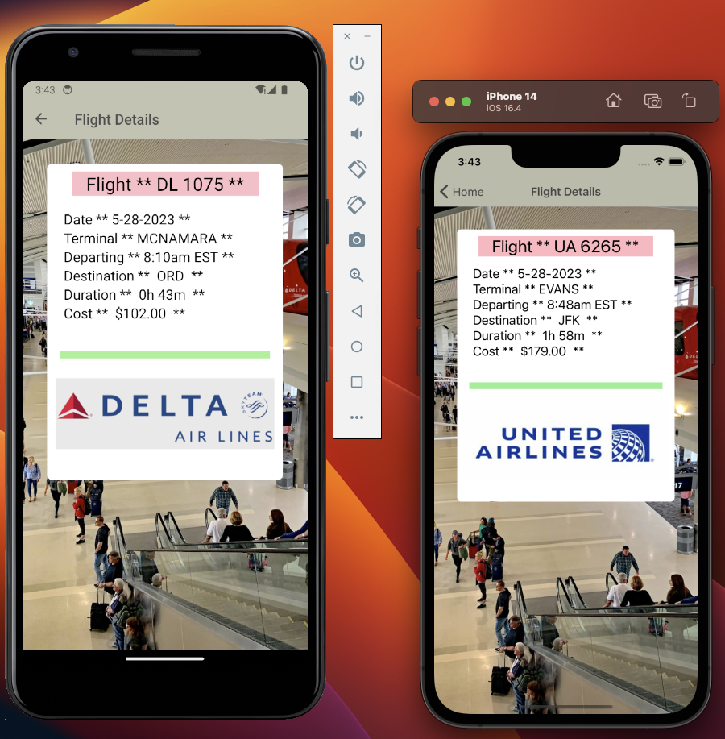

# React Native App - Airport Simulation

## Flow of App

- Below is the base diagram which showcases the Home Screen (main screen) when the application is running, and the Flight Details screen that displays different objects based on the one flight you tap on from the Home Screen. You are able to move back and forth across the two screens to check out each individual flight:
  

* I also added another screen to allow the user to submit feedback, which will get logged out in console, so operator/code owner(s) can monitor feedback:
  

## Images

Below is an example of how a basic review screen looks like. I added some updates to organize the flights better and you can compare side-by-side with an Android and iOS:

## Why I chose React-Native over its alternatives?

- While tools like Flutter can be compatible with many Android devices, React Native apps sometimes require lower SDK version minimums, making them more lightweight.
- In my opinion, React Native supports third-party plugs and can have cost-effective feature expansion with many independent modules.
- While Kotlin works well with existing Java code compiling, React Native is open-source and community-driven, allowing developers like myself to reach out to a large community for resources and tutorials.

## Future Work

- One thing I can add is a component that will let me use a side drawer menu, beginning with a button. This will make it easier to go through other pages once they are added as opposed to just using a stack-navigator component.
- Projects can always benefit from more tests (unit, integration, end-to-end)
